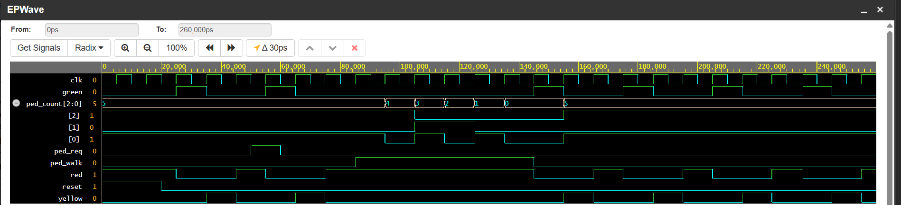

# Traffic Light Controller (Verilog)

This project implements an FSM-based traffic light controller in SystemVerilog.
It supports a pedestrian request button and a countdown timer.

## Features
- FSM-based traffic light control
- Pedestrian request button
- Countdown timer (5 → 0)
- Verified using EDA Playground waveforms

## Pedestrian Countdown Verification

The waveform below shows the pedestrian walk signal and countdown timer.

