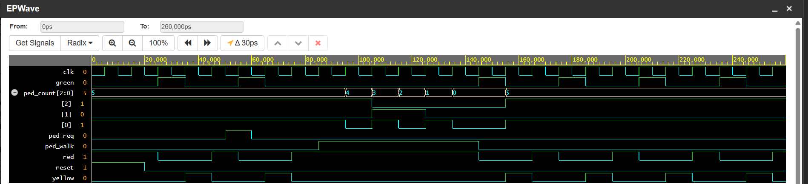

# Traffic Light Controller with Pedestrian Crossing (SystemVerilog)

## Overview

This project implements a **finite state machine (FSM) based traffic light controller** with **pedestrian crossing support** using **SystemVerilog**.

The controller manages a standard **three-color traffic signal (Red, Yellow, Green)** while also allowing pedestrians to request a **safe crossing interval**. When a pedestrian presses the request button, the system temporarily stops vehicle traffic and enables a **pedestrian walk signal with a countdown timer**.

The design is written for **digital hardware simulation and FPGA implementation**, making it suitable for learning **FSM design, synchronous logic, and hardware verification**.

---

# Features

* Finite State Machine (FSM) traffic control
* Pedestrian request button
* Pedestrian request **latching**
* Pedestrian **walk signal**
* **Countdown timer** for pedestrian crossing
* Clean **SystemVerilog design using `logic`, `always_ff`, and `always_comb`**
* Easily synthesizable for **FPGA or ASIC design flows**

---

# Traffic Light States

The controller operates using **four states**:

| State     | Description                                                         |
| --------- | ------------------------------------------------------------------- |
| `RED_CAR` | Cars stop (red light), waiting for next cycle or pedestrian request |
| `GREEN`   | Cars move (green light)                                             |
| `YELLOW`  | Warning state before stopping traffic                               |
| `RED_PED` | Cars stop, pedestrians allowed to walk                              |

---

# State Transition Diagram

```id="tkhivl"
        +---------+
        | RED_CAR |
        +----+----+
             |
             v
          +-----+
          |GREEN|
          +--+--+
             |
             v
          +------+
          |YELLOW|
          +--+---+
             |
             v
         +--------+
         |RED_CAR |
         +--------+

If pedestrian button pressed:

RED_CAR → RED_PED → GREEN
```

---

# Inputs

| Signal    | Description                        |
| --------- | ---------------------------------- |
| `clk`     | System clock                       |
| `reset`   | Asynchronous reset                 |
| `ped_req` | Pedestrian crossing request button |

---

# Outputs

| Signal           | Description                             |
| ---------------- | --------------------------------------- |
| `red`            | Red traffic light                       |
| `yellow`         | Yellow traffic light                    |
| `green`          | Green traffic light                     |
| `ped_walk`       | Pedestrian walk signal                  |
| `ped_count[2:0]` | Countdown timer for pedestrian crossing |

---

# Pedestrian Request Handling

When a pedestrian presses the button:

1. `ped_req` becomes **1**
2. The request is **latched** using `ped_latched`
3. At the next safe moment (`RED_CAR` state), the system transitions to **RED_PED**
4. Vehicles remain stopped while pedestrians cross
5. A **countdown timer** runs from **5 to 0**
6. When the timer finishes, traffic resumes

This ensures **pedestrian safety without interrupting traffic mid-cycle**.

---

# Countdown Timer

The pedestrian crossing time is controlled using a **3-bit timer**:

```id="ow1kjv"
logic [2:0] ped_timer;
```

Behavior:

* Reloads to **5 seconds** when not in pedestrian state
* Decrements every clock cycle during `RED_PED`
* When it reaches **0**, traffic resumes

---

# Finite State Machine

The controller uses a **Moore FSM**, meaning outputs depend only on the **current state**.

### State Encoding

```id="rfe4ty"
typedef enum logic [1:0] {
    RED_CAR = 2'b00,
    GREEN   = 2'b01,
    YELLOW  = 2'b10,
    RED_PED = 2'b11
} state_t;
```

---

# Output Behavior

| State   | Red | Yellow | Green | Pedestrian Walk |
| ------- | --- | ------ | ----- | --------------- |
| RED_CAR | 1   | 0      | 0     | 0               |
| GREEN   | 0   | 0      | 1     | 0               |
| YELLOW  | 0   | 1      | 0     | 0               |
| RED_PED | 1   | 0      | 0     | 1               |

---


# Example Operation

1. System starts in **RED_CAR**
2. Vehicles get **GREEN**
3. Transition to **YELLOW**
4. Return to **RED_CAR**
5. If pedestrian presses button:

   * Controller enters **RED_PED**
   * Pedestrian walk signal turns on
   * Countdown begins
6. After countdown, vehicles get **GREEN** again

---

# Author

SystemVerilog Traffic Light Controller with Pedestrian Crossing — designed for **FSM learning and hardware simulation**.

## Pedestrian Countdown Verification

The waveform below shows the pedestrian walk signal and countdown timer.


